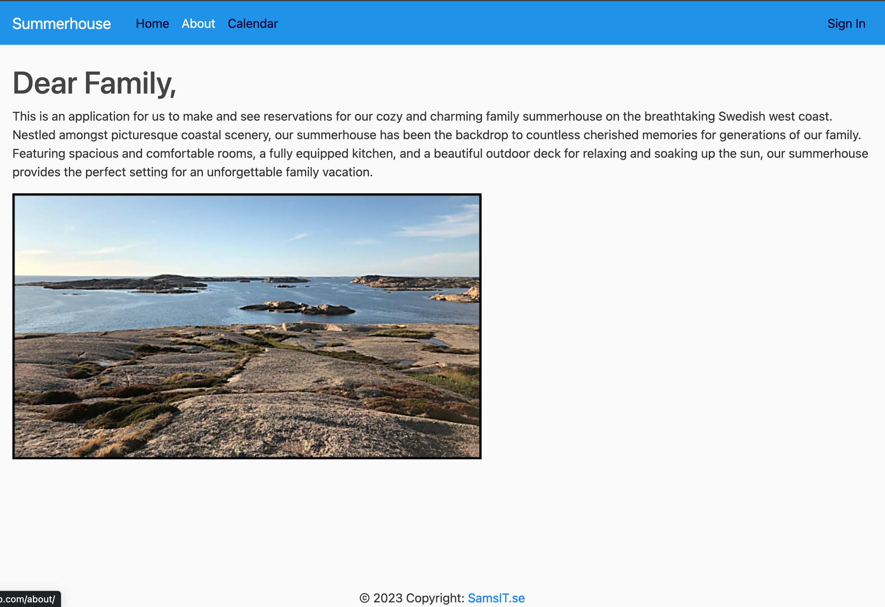

# Summerhouse reservation

Summerhouse reservation is an app for my family to make reservations of our summerhouse we share on the Swedish west coast. This is a first mvp (minimum viable product) which I belive will fullfill our basic need for making plans for our holidays in the summerhouse. But of course there are features to add in the future. Because it will only be used by my family I don't want anyone make an account by them self and they must sign in to enter. Account must be set up by Admin. For this demo it is open for anonymous and there is also 3 accounts in place for testing.

# Features

## Existing Features
* Home page
  * Navigation Bar
  * List of all reservations.
  * If signed in a link to reservation form.
* About page
  * Short description for my family members.
* Calendar page
  * Calendar view to see all reservations.  
* Profile link
  * If signed in a link to the profile form.
* Sign In link
  * Link to sign in form.
* Sign out link
  * If signed in a link to sign out.

### Navigation Bar

- Featured on all pages, the full responsive navigation bar includes links to the Logo, Home page, About, Calendar and Sign in page and is identical in each page to allow for easy navigation.

- Featured on all pages, but when signed in there are more links in the navigation bar. New reservation,  Profile and Sign Out.

### The landing page

The landing includes a photograph with text overlay to allow the user to see exactly which location this site would be applicable to.

### The about page

The about page gives information about ability to bicycle train in a group and where and when the training starts. 

### The calendar page

Here you can add name and email address to join a group training session and information on what level you are and which distances you prefer.

### The sign in page

Here you can add name and email address to join a group training session and information on what level you are and which distances you prefer.

### The sign in page

Here you can add name and email address to join a group training session and information on what level you are and which distances you prefer.

### The sign in page

A form to sign in with username and password.

## Features left to implement
- Change password.
- Improve Calendar view on how reservations is displayed.
- Check if a room is already booked
- Integrate with Slack channel

# Testing
Test is done manual on browsers Chrome, Safari and Firefox. Responsiveness has been tested with browsers development tools. It is also tested on iPhone X and iPad Air.
Users: Sam (Admin), Lisa and Kalle. Password: SummerOf69

* Sign in with admin account Sam in Admin Page (https://samsite.herokuapp.com/admin/) to register test users and add profiles.
  * Add new user - outcome: User Anna was created with password SummerOf69.
  * Create profile for user Anna without choosing a profile image - outcome: A profile is created with a default profile image
* Connect to https://samsite.herokuapp.com/ - outcome: Landed on Sommerhouse home page.
* Click on link About - outcome: Landed on About page, https://samsite.herokuapp.com/about
* Click on link Calendar - outcome: Landed on Calendar page, https://samsite.herokuapp.com/calendar
* Click on link Home - outcome: Landed on Home page, https://samsite.herokuapp.com/ with the two newest booking shown. If more then  two reservation exist pageing buttons appear under the two bookings
* Click on link Sign In - outcome: Landed on Sign in form, https://samsite.herokuapp.com/signin

### As test user Anna: 
* Sign in with username Anna and no password - outcome: Field message pops up, "Please fill in this field"
* Sign in with username Anna and wrong password - outcome: A message in red appears, "Please enter a correct username and password. Note that both fields may be case-sensitive."
* Sign in with username Anna and right password - outcome: Landing back to home page. New reservation and Profile link appears in the navigation bar.
* Click on link New reservation - outcome: Open New reservation form
* Click on Post with empty Title and comment fields - outcome: Field message pops up in the first empty field, "Please fill in this field"
* Click on Post with a Title and comment - outcome: Reservation is saved and a view with reservation info appears with an update and delete button.
* Click on update - outcome: Reservation form is opened 
* Updated reservation with other dates and comments - outcome: Back to reservation info appears with an update and delete button.
* Click on delete button - outcome: A confirmation page is shown with two buttons, "Yes, delete" and "Cancel". If "Cancel" is clicked reservation info appears with an update and delete button. If "Yes, delete" is clicked post is deleted and home page is shown.
* Click on Profile link - outcome: Profile form appears. Here must the user add an email address and can upload a new profile image. When Update button is clicked a green message "Your account has been updated!" appears
* Click on others reservations - outcome Reservation info is shown, but without update or delete button
* Click on Calender link- outcome: Landed on Calender page with all reservations
* In calendar click Previous or Next month - outcome: Page updates with previous or next month dates

Next move is to add automated test.

# Validator Testing

### HTML
No errors were returned when passing through the official W3C validator.
### CSS
No errors were found when passing through the official (Jigsaw) validator. Although there are still some css issues to handle because different browsers render css in different ways. Chrome works best for this application. 
### Accessibility
The Lighthouse test tool show good result in accesibility

# Bugs
 * Styling bugs still exists on how different browsers render css.
 * 

# Deployment
The site was deployed Heroku with a Postgres database on ElephantSQL cloud service and static files is handled by cloud service Cloudinary.
App is deployed as follows:
* Heroku is connected to GitHub repository Samssite.
* Under settings in Heroku config vars is set for connection to the Elephant and Cloudinary. Port and Django secret key is also set.
* In deploy section in Heroku choose branch main to deploy and press button "Deploy Branch". Look in the log that everything is installed correct.

The live link can be found here - [(https://samsite.herokuapp.com/)](https://samsite.herokuapp.com/)

# Credits
Example code and design is used from:
- Code Institute 
- Corey Schaffer
- Hui Wen
- Read the Docs
- Django, Bootstrap documentation

# Media
Is my own photos.
